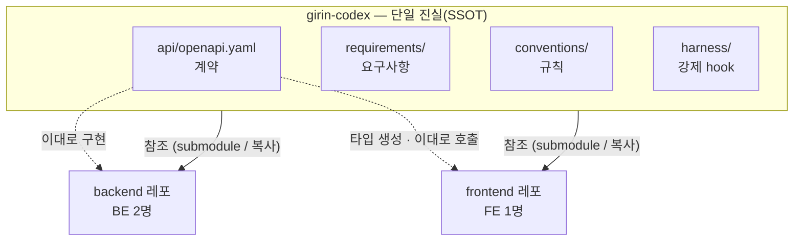
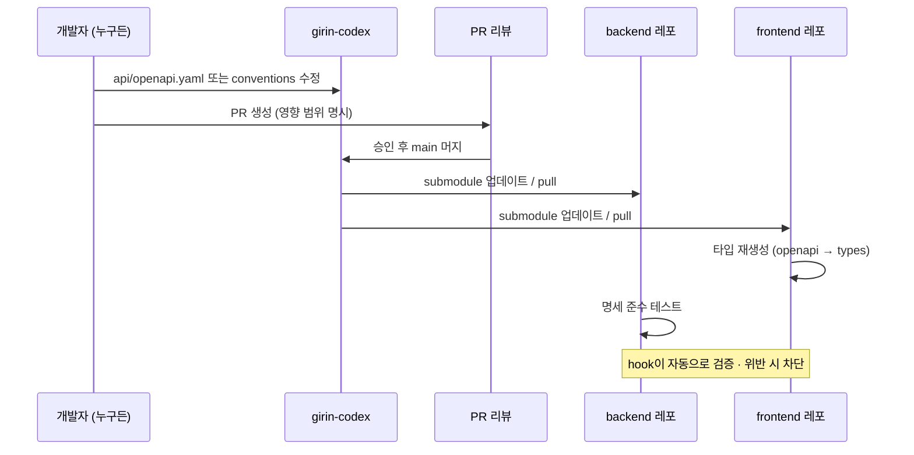
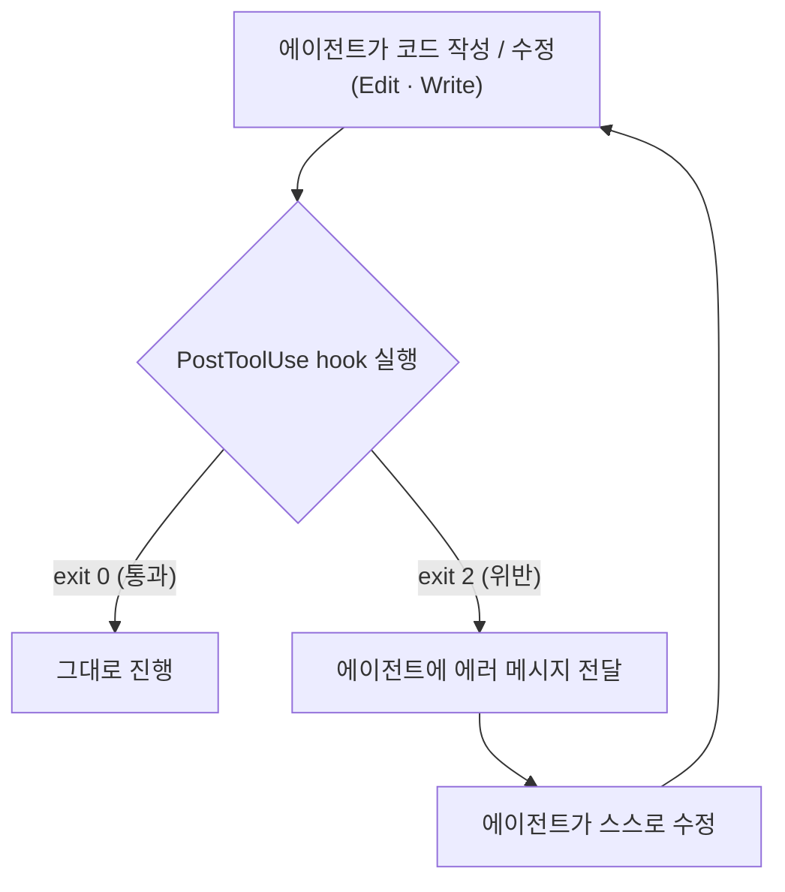
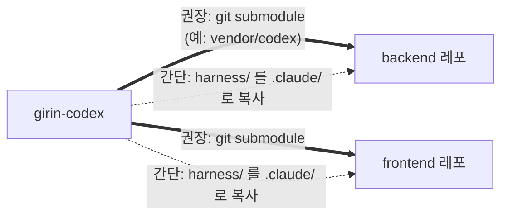
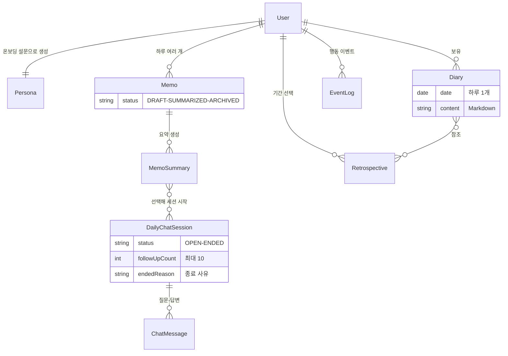
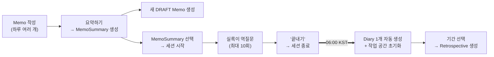
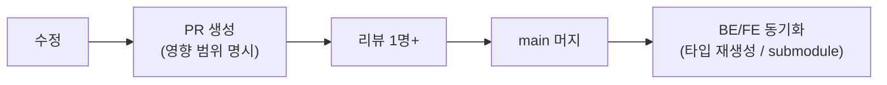

# girin-codex

> **내가그린기린기록** 프로젝트의 단일 진실 공급원(SSOT)이자 하네스 규칙 저장소.
> 백엔드 2명 · 프론트엔드 1명이 **바이브 코딩**으로 협업할 때,
> 세 사람(과 각자의 AI 에이전트)이 **같은 계약 · 같은 규칙 · 같은 강제 장치**를 바라보게 만드는 곳.


> [!IMPORTANT]
> **이 레포엔 애플리케이션 코드가 없습니다.** 여기 있는 건 "모두가 따라야 하는 것"뿐입니다 —
> 요구사항(`requirements/`), 계약(`api/openapi.yaml`), 규칙(`conventions/`), 강제 장치(`harness/`).
> 기능은 backend/frontend 레포에서 구현하고, 그 레포들이 **이 레포를 참조**합니다.

---

## 🧭 한눈에 보기



규칙을 BE 레포나 FE 레포 한쪽에 두면 다른 쪽은 그걸 "남의 것"으로 본다.
계약과 규칙을 **중립 지대(이 레포)** 에 두고 양쪽이 참조하면,
명세가 한 곳에서만 바뀌고, 타입이 한 소스에서 생성되고, hook 설정이 세 사람 모두 동일하게 적용된다.

---

## 💡 단 하나의 원칙

> [!NOTE]
> ### `api/openapi.yaml`이 옳다. 코드가 명세와 다르면, 틀린 건 코드다.

명세는 **사람이 합의해서** 바꾸고(PR + 리뷰), 코드는 명세를 따른다.
이 한 줄을 사람의 의지가 아니라 `harness/`의 **hook이 강제**한다. (아래 [2층 방어](#-2층-방어-claudemd-지향--hook-강제) 참고)

---

## 📂 레포 구조

```text
girin-codex/
├── README.md            ← 지금 이 문서 (이거 하나로 충분)
├── AGENTS.md            ← Codex/Claude 공통 에이전트 지침
├── CLAUDE.md            ← Claude Code용 얇은 진입점
├── .claude/
│   └── settings.json    ← 이 레포용 hook (openapi 유효성 검사)
├── requirements/        ← 기능 요구사항 · 시나리오 · 결정 이력
│   ├── product.md
│   ├── scenarios.md
│   └── decisions.md
├── api/
│   ├── openapi.yaml     ← ★ 계약(SSOT). 모든 엔드포인트의 진실
│   └── README.md
├── conventions/         ← 규칙 문서들 (에이전트가 표류하지 않게 잡아주는 가이드)
│   ├── api.md           ·  에러 envelope · 06:00 KST 경계 · 인증 · 상태코드
│   ├── coding.md        ·  스택 · BE 도메인 분담 · 디렉터리
│   ├── git.md           ·  한국어 커밋 · 브랜치 · PR
│   └── glossary.md      ·  용어 한↔영 고정 (Diary/Retrospective…)
├── domain/
│   └── data-model.md    ← 엔티티 정의 (User · Persona · Memo · …)
└── harness/             ← BE/FE 레포가 가져다 쓰는 강제 장치
    ├── SETUP.md         ·  설치 방법
    ├── settings.template.json
    └── hooks/           ·  포맷 · 스펙 드리프트 · 브랜치 보호
```

| 경로 | 역할 | 누가 보나 |
| --- | --- | --- |
| `requirements/` | 기능 요구사항, 시나리오, 결정 이력 | 기획 · BE · FE · 에이전트 |
| `api/openapi.yaml` | **계약.** 모든 엔드포인트의 단일 진실 | BE · FE · 에이전트 |
| `conventions/` | 코딩·API·Git·용어 규칙 | 사람 · 에이전트 |
| `domain/data-model.md` | 엔티티 정의 | 사람 · 에이전트 |
| `harness/` | BE/FE에 복사/연결하는 강제 hook | 셋업 담당 |
| `AGENTS.md` | 이 레포 작업 에이전트의 공통 컨텍스트 | 에이전트 |
| `CLAUDE.md` | Claude Code용 진입점 | 에이전트 |

---

## 🔄 이 하네스는 어떻게 도는가

명세나 규칙이 바뀔 때의 흐름. **변경은 항상 이 레포에서 시작**해서 BE/FE로 퍼진다.



핵심: 누구도 명세를 임의로 "추측"해서 코드부터 바꾸지 않는다.
바꾸려면 **여기서 PR → 합의 → 머지 → 양쪽 동기화** 순서를 탄다.

---

## 🛡 2층 방어: AGENTS.md (지향) ↔ hook (강제)

`AGENTS.md`/`conventions/`는 에이전트가 **겨냥**할 방향이고(안 지킬 수 있음),
`harness/`의 hook은 **매번 실행되는 강제**다. 둘은 대체재가 아니라 레이어다.



| 레이어 | 무엇 | 강제력 | 다루는 것 |
| --- | --- | --- | --- |
| **AGENTS.md / conventions** | 지향·의도·용어 | 약함 (제안) | "왜 이렇게 하는지", 좋은 추상화, 도메인 맥락 |
| **harness/hooks** | 셸 명령으로 통과/실패 판정 | 강함 (매번 실행) | 포맷·린트·타입체크·**명세 준수**·테스트·브랜치 보호 |

> 규칙을 프롬프트에만 두면 "안 따를" 수 있다. hook으로 인코딩하면 제안이 **매번 실행되는 코드**가 된다.
> 종료 코드 0 = 통과, 2 = 차단(에이전트에 사유 전달 → 자가 수정).

---

## 🔌 BE / FE에 어떻게 연결하나



1. 각 레포 루트에 `.claude/settings.json`을 둔다 → `harness/settings.template.json` 복사 후 경로만 수정.
2. `harness/hooks/`의 스크립트를 각 레포에서 실행 가능하게 둔다(복사 또는 submodule 경로 참조).
3. 커밋한다. 팀원 전원의 에이전트가 **동일 hook**을 공유한다.

자세한 설치는 **[`harness/SETUP.md`](harness/SETUP.md)**.

---

## 🗂 도메인 한눈에

이 레포의 규칙/명세가 무엇을 다루는지 감 잡으라고 넣은 도메인 지도. (정확한 정의는 [`domain/data-model.md`](domain/data-model.md))



### 하루의 흐름 (06:00 KST 경계)

> 이 서비스의 "하루"는 자정이 아니라 **06:00 KST**에 바뀐다.



- Memo는 **하루 여러 개**, 세션도 **하루 여러 개**, 하지만 **Diary는 하루 1개**.
- 대화는 Memo가 아니라 **하나 이상의 MemoSummary 선택**으로 시작한다.
- 역질문은 **최대 10회**(프롬프트로 강제), '끝내기' 버튼/AI 판단으로 종료.
- **06:00 KST**: Diary 자동 생성 + 일일 작업 공간 초기화.

---

## 🚀 빠른 시작

```bash
# 1. (최초 1회) 레포 초기화
git init
git add .
git commit -m "chore: girin-codex 초기 구조 추가"
git remote add origin <원격-레포-URL>
git push -u origin main

# 2. 실제 API 명세를 받으면 api/openapi.yaml 에 채운다.
# 3. conventions/ 의 [확정 필요] 를 팀이 합의해서 채운다.
# 4. BE/FE 레포에서 harness/SETUP.md 대로 hook 을 설치한다.
# 5. 끝. 세 사람의 에이전트가 같은 규칙 위에서 코딩한다.
```

---

## 📐 규칙 인덱스

| 문서 | 핵심 내용 |
| --- | --- |
| [`requirements/product.md`](requirements/product.md) | MVP 기능 요구사항 · 제외 범위 · 백엔드 결정사항 |
| [`requirements/scenarios.md`](requirements/scenarios.md) | 사용자 흐름별 시나리오 · 인수 조건 |
| [`requirements/decisions.md`](requirements/decisions.md) | 날짜 / 결정 / 이유 / 영향 범위 |
| [`conventions/api.md`](conventions/api.md) | 에러 envelope 고정 · 06:00 KST 일자 경계 · 세션 라이프사이클 · 인증 · 상태코드 · 페이지네이션 |
| [`conventions/coding.md`](conventions/coding.md) | 스택 확정 · **BE 2명은 레이어가 아니라 도메인으로 분담** · 디렉터리 · LLM 호출 격리 |
| [`conventions/git.md`](conventions/git.md) | 한국어 커밋 메시지 · 브랜치 전략 · PR 규칙(영향 범위 명시) |
| [`conventions/glossary.md`](conventions/glossary.md) | 한↔영 용어 단일화(Diary/Retrospective/Memo …) · 표기 규칙 |
| [`domain/data-model.md`](domain/data-model.md) | 엔티티 정의 · MemoSummary 기반 대화 · EventLog |

---

## 📝 변경 규칙



- 이 레포의 변경은 **항상 PR**. `main` 직접 push 금지(특히 `api/`, `conventions/`).
- 명세·용어 변경은 BE/FE 양쪽에 파급되므로 **PR 설명에 영향 범위를 적는다.**
    - 예: `Diary.content` 필드명 변경 → FE 타입 재생성 필요, BE 직렬화 수정 필요.
- 머지되면 의존 레포는 타입 재생성 / submodule 업데이트를 돌린다.

---

## ❓ FAQ

<details>
<summary><b>여기에 백엔드/프론트 코드를 두면 안 되나요?</b></summary>

안 됩니다. 이 레포는 "모두가 따르는 것"만 둡니다. 코드를 두면 다시 한쪽으로 기울어 SSOT가 깨집니다.
</details>

<details>
<summary><b>명세에 없는 엔드포인트가 필요해요.</b></summary>

먼저 `api/openapi.yaml`에 PR로 추가·합의한 뒤 구현하세요. "코드부터, 명세는 나중에"는 금지입니다.
</details>

<details>
<summary><b>[확정 필요] 는 뭔가요?</b></summary>

팀 합의가 필요한 빈칸입니다(스택, JWT 여부, 페이지네이션 방식, 마크다운 파일 구성 등).
에이전트가 임의로 채우지 않습니다. 합의 후 사람이 채웁니다.
</details>

<details>
<summary><b>hook 이 위험하지 않나요?</b></summary>

hook 은 현재 환경의 자격증명으로 자동 실행됩니다. 설치/수정 전 스크립트를 반드시 리뷰하세요. (`harness/SETUP.md`)
</details>
